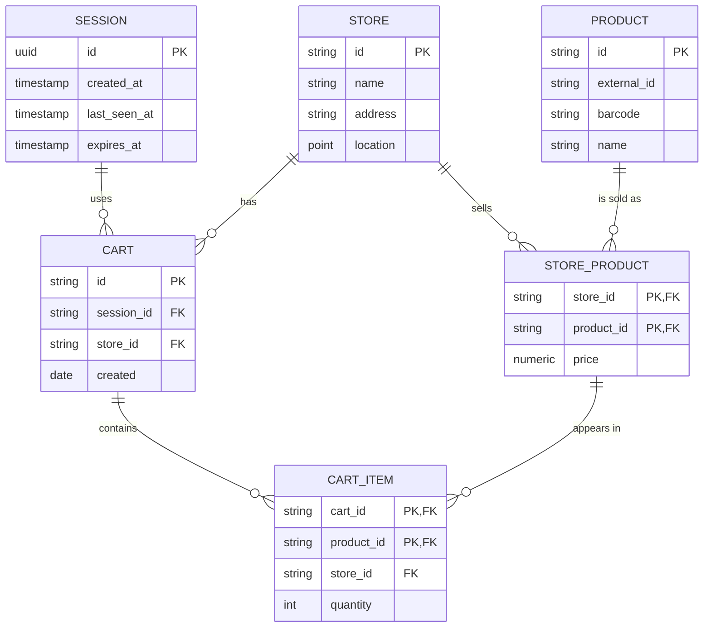

```mermaid
erDiagram
    SESSION ||--o{ CART : uses
    CART ||--o{ CART_ITEM : contains
    STORE_PRODUCT ||--o{ CART_ITEM : "appears in"
    STORE ||--o{ CART : has
    STORE ||--o{ STORE_PRODUCT : sells
    PRODUCT ||--o{ STORE_PRODUCT : "is sold as"
    SESSION {
        uuid id PK
        timestamp created_at
        timestamp last_seen_at
        timestamp expires_at
    }
    CART {
        string id PK
        string session_id FK
        string store_id FK
        date created
    }
    PRODUCT {
        string id PK
        string external_id
        string barcode
        string name
    }
    CART_ITEM {
        string cart_id PK,FK
        string product_id PK,FK
        string store_id FK
        int quantity
    }
    STORE {
        string id PK
        string name
        string address
        point location
    }
    STORE_PRODUCT {
        string store_id PK,FK
        string product_id PK,FK
        numeric price
    }
```